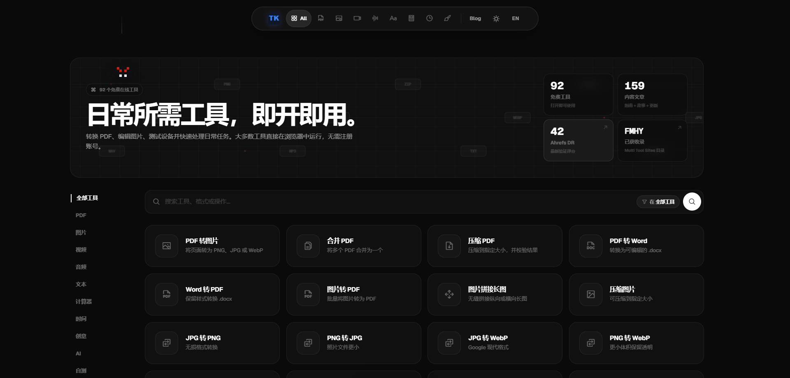

<div align="center">


<h1>ToolKnit Desktop 3.1</h1>

<p><strong>本地文件工作台 · 桌面端、网页端与 AI Agent 工作流</strong></p>

<p>
  把 PDF、PPT、图像、音视频、Markdown、开发者工具和 AI 内容工作，收拢到一套清晰、可靠、可复用的工具体系里。
</p>

<p>
  <a href="https://toolknit.com"></a>
  <a href="https://github.com/ZihangDong/toolknit-desktop/releases"></a>
  <a href="#cli--mcp--agent"></a>
</p>

<p>
  <a href="README_EN.md"></a>
  
  
  
  
  <a href="LICENSE"></a>
</p>

<p>
  <a href="https://github.com/ZihangDong/toolknit-desktop/stargazers"></a>
  <a href="https://github.com/ZihangDong/toolknit-desktop/network/members"></a>
  <a href="https://github.com/ZihangDong/toolknit-desktop/issues"></a>
  <a href="https://github.com/ZihangDong/toolknit-desktop/graphs/contributors"></a>
</p>

</div>

<p align="center">
  <a href="#v30-核心更新">3.0 正式版</a> ·
  <a href="#完整功能目录">69 项工具</a> ·
  <a href="#本地优先与隐私边界">隐私边界</a> ·
  <a href="#从源码运行">源码运行</a> ·
  <a href="#cli--mcp--agent">CLI / MCP</a>
</p>

<table cellpadding="18" cellspacing="0">
  <tr>
    <td width="50%" valign="top">
      <p> <strong>先用网页版</strong></p>
      <p>无需安装，打开浏览器即可使用同名官方网页端。</p>
      <p><a href="https://toolknit.com"><strong>打开 ToolKnit.com</strong></a></p>
      <sub>适合快速体验、跨平台使用和不方便安装桌面应用的场景。</sub>
    </td>
    <td width="50%" valign="top">
      <p> <strong>再用桌面端</strong></p>
      <p>Windows 本地优先版本，适合长期文件工作、离线处理和可视化编辑。</p>
      <p><a href="https://github.com/ZihangDong/toolknit-desktop/releases"><strong>查看桌面端下载</strong></a></p>
      <sub>通过 GitHub Releases 获取 Windows 安装包、SHA-256 校验文件和完整版本说明。</sub>
    </td>
  </tr>
</table>

## ToolKnit 3.1 Preview

ToolKnit Desktop 3.1 测试版是一套面向 Windows 的本地文件工作台。它把常用文件处理、图像与 Markdown 创作、开发者工具、AI 内容生产、专业文档工作流和 IDE Agent 自动化放在同一个产品体系里。V3.1 尚未正式发布，正式发布版仍为 V3.0。

桌面端提供可视化工作台，其中适合自动化的能力还可以通过 CLI 批处理、MCP Agent 调用。网页端提供免安装入口，各端功能范围以对应目录为准。

<table width="100%" cellpadding="14" cellspacing="0">
  <tr>
    <td align="center"><h3>69</h3><strong>桌面工具</strong></td>
    <td align="center"><h3>12</h3><strong>功能分类</strong></td>
    <td align="center"><h3>46</h3><strong>MCP 能力</strong></td>
    <td align="center"><h3>3</h3><strong>工作方式</strong></td>
    <td align="center"><h3>Windows</h3><strong>首发平台</strong></td>
    <td align="center"><h3>Local-first</h3><strong>隐私策略</strong></td>
  </tr>
</table>

## V3.0 核心更新

相比 v2.3.1，V3.0 的桌面工具从 65 项扩展到 68 项，保留 12 个分类与 46 项 CLI / MCP 能力。此次升级同时完善双主题、PDF / PPT 工作流、清理安全和应用启动体验。

### 新增能力

- `PDF 文本提取 / Markdown`：无需 AI Key，在本机提取电子 PDF 的文本层，重建基础排版并保留页码来源；转换后直接进入现有 Markdown 编辑器。扫描件会提示使用 AI 视觉版。
- `AI PDF 转 Markdown`：适合扫描件与复杂排版，先逐页渲染并交给用户配置的视觉模型分析，再汇总为结构化 Markdown，支持页码来源、文档摘要、重试、取消和继续编辑。
- `Windows 剪贴板历史`：开启监控后记录后续复制的文字、PNG 图片和文件路径，按时间线保存，支持搜索、筛选、收藏、图片预览和本地加密；不会导入既有 Win+V 历史，退出程序后停止监控。

### 全面升级

- `白天 / 深色模式`：工具页、设置与帮助中心统一适配两套主题，覆盖上传、处理、结果、错误、焦点和禁用状态；启动加载遮罩与主题切换过渡减少字体和背景加载时的闪变。
- `PDF / PPT 工作台`：统一上传、预览、进度、导出和结果弹层；PDF 编辑支持页面操作、文字与图像插入、撤销重做和安全导出；PPT 工具共享转换、预览和素材工作流。
- `AI 工作流`：完善 PPT 大纲解读、本地图片素材与可编辑 PPTX 草稿；润色、翻译、文档、表格和 PPT 工具复用密钥校验、错误恢复及输出校验。
- `媒体与离线能力`：修复视频预览首次播放与连续播放问题，视频转 GIF 上传后自动展开预览；FFmpeg、LibreOffice、Whisper 和本地视觉模型按需检测和下载。
- `清理安全边界`：AI 大文件清理支持目录与 C 盘整盘扫描，排除受保护系统目录、链接和系统属性文件，并在删除前重新校验；C 盘清理按风险档位展示系统缓存。扫描结果仍需用户检查，保护规则不能代替个人判断。
- `颜色空间对比`：增加 HSV / HSL 双色轮与 HEX 输入，保留多空间联动、色域检测和双主题体验。
- `应用稳定性`：工具懒加载，重复打开、返回、Escape、窗口关闭和失败路径统一释放 Worker、Canvas、监听器、任务和临时资源，过期异步结果不会写入新会话。

V3.0 的桌面端、Tauri、Rust 原生运行时和 `@toolknit/cli` 版本统一为 `3.0.0`。桌面安装包见 [GitHub Releases](https://github.com/ZihangDong/toolknit-desktop/releases)，命令行工具见 [npm](https://www.npmjs.com/package/@toolknit/cli)。

### 持续保留的基础能力

ToolKnit 继续遵循本地优先原则：重型编辑器和算法模块按需加载，离开页面后主动释放后台资源；网页端、Windows 桌面端、CLI 和 MCP Agent 共用清晰的输入输出边界。

<table cellpadding="16" cellspacing="0">
  <tr>
    <td width="50%" valign="top">
      <p></p>
      <h3>Markdown 文档编辑器</h3>
      <p>分屏编辑与实时预览 GFM、Mermaid 和数学公式，支持标题大纲、本地草稿以及 Markdown / 自包含 HTML 导出。</p>
    </td>
    <td width="50%" valign="top">
      <p></p>
      <h3>图像裁剪与智能颜色替换</h3>
      <p>提供多种比例、构图辅助线、居中吸附和原图导出；通过吸管、阈值、柔化与智能区域保护精确替换颜色。</p>
    </td>
  </tr>
  <tr>
    <td width="50%" valign="top">
      <p></p>
      <h3>颜色空间对比</h3>
      <p>联动查看 8 种颜色空间，检测 sRGB、Display P3、Adobe RGB 与 Rec.2020 色域，并通过可视化轨道观察分量变化。</p>
    </td>
    <td width="50%" valign="top">
      <p></p>
      <h3>开发者工具分类</h3>
      <p>新增 JSON 格式化、Base64、URL 编解码、UUID v4 批量生成和 JWT 查看，输入与结果只保留在当前会话。</p>
    </td>
  </tr>
  <tr>
    <td width="50%" valign="top">
      <p></p>
      <h3>Hash &amp; Crypto</h3>
      <p>覆盖摘要、文件 Hash、HMAC、对称和非对称算法等 17 个模块；旧算法明确标注兼容用途，敏感数据不写入历史。</p>
    </td>
    <td width="50%" valign="top">
      <p></p>
      <h3>自定义背景与玻璃工作台</h3>
      <p>支持图片或视频壁纸，首页、分类与工具页面统一玻璃拟态语言；卡片使用克制的水膜波纹反馈，并强化复杂背景下的可读性。</p>
    </td>
  </tr>
  <tr>
    <td width="50%" valign="top">
      <p></p>
      <h3>PDF 编辑与安全输出</h3>
      <p>加入页面复制、空白页、批量选择和可重复文字编辑，并在关闭、替换和重置前保护未导出修改。</p>
    </td>
    <td width="50%" valign="top">
      <p></p>
      <h3>依赖复用与性能治理</h3>
      <p>优先检测电脑上已有的 FFmpeg 与 LibreOffice；预览任务降采样并可淘汰过期结果，页面关闭时主动释放后台资源。</p>
    </td>
  </tr>
</table>

<p align="center"><sub>感谢 <a href="https://github.com/Joshua-Zion">Joshua-Zion</a>：颜色空间换算核心基于 <a href="https://github.com/ZihangDong/toolknit-desktop/pull/23">PR #23</a> 移植与扩展，3.0 参考 <a href="https://github.com/ZihangDong/toolknit-desktop/pull/67">PR #67</a> 融合双色轮与输入交互增强。</sub></p>

## 三种工作方式

<table cellpadding="16" cellspacing="0">
  <tr>
    <td width="33%" valign="top">
      <p></p>
      <h3>网页端</h3>
      <p>开箱即用，无需安装。适合快速处理和跨平台访问。</p>
      <a href="https://toolknit.com">进入 ToolKnit.com</a>
    </td>
    <td width="33%" valign="top">
      <p></p>
      <h3>桌面端</h3>
      <p>文件留在本机，提供预览、拖拽、批量处理、可视化编辑和依赖管理。</p>
      <a href="https://github.com/ZihangDong/toolknit-desktop/releases">查看 Releases</a>
    </td>
    <td width="33%" valign="top">
      <p></p>
      <h3>CLI 与 Agent</h3>
      <p>适合脚本、批处理、CI 和 IDE Agent，用自然语言调用可验证的本地能力。</p>
      <a href="#cli--mcp--agent">查看接入方式</a>
    </td>
  </tr>
</table>

## 完整功能目录

下面按桌面端的 12 个分类列出当前源码中的全部 69 项工具，包含 V3.1 开发中的 PDF 转扫描件；已发布 V3.0 为 68 项。名称对应应用内入口，支持的 CLI / MCP 能力会在相应工具成熟后提供同一套输入输出契约。

<table width="100%" border="0" cellpadding="0" cellspacing="0">
  <tr><td align="left" style="border:0;"></td><td align="right" style="border:0;"><h3 align="right">PDF 文档工具 · 14 项</h3></td></tr>
</table>

`PDF 文件合并` · `PDF 文件拆分` · `PDF 加页码` · `PDF 裁剪` · `PDF 转图像` · `PDF 转扫描件` · `PDF 文本提取 / Markdown` · `PDF 编辑器` · `PDF 页面旋转` · `PDF 文件加密` · `PDF 文件解密` · `PDF 文件压缩` · `PDF 文字增强` · `Excel 转 PDF`

PDF 转扫描件在本机逐页生成纯图像 PDF，提供原稿、灰度和自然扫描效果、页码选择与 150/200/300 DPI。保留页面尺寸及方向；输出不保留可选文字、链接、表单或原数字签名，也不阻止 OCR。详见[处理边界](toolknit-desktop/docs/PDF_TO_SCAN.zh-CN.md)。

支持拖拽排序、逐页预览、选页导出、页码写入、无损裁剪、页面旋转、文字替换、文本与图像插入、追加合并、密码保护、扫描件增强、多等级压缩和工作簿本地渲染。PDF、工作簿、密码和导出结果默认只在本机处理。

<table width="100%" border="0" cellpadding="0" cellspacing="0">
  <tr><td align="left" style="border:0;"></td><td align="right" style="border:0;"><h3 align="right">PPT 演示文稿工具 · 7 项</h3></td></tr>
</table>

`PPT 转 PDF` · `PPT 转图片` · `PPT 图片提取` · `PPT AI 文本提取` · `PPT 压缩` · `AI 生成 PPT 大纲` · `AI 生成 PPT 草稿 / PPTX`

支持逐页渲染、页码选择、PNG/JPG/WebP 输出、素材去重、标题正文备注提取、Markdown/TXT/JSON 导出、媒体清理，以及从主题和资料生成结构化大纲与可编辑 PPTX 草稿。PPT 渲染运行时按需下载。

<table width="100%" border="0" cellpadding="0" cellspacing="0">
  <tr><td align="left" style="border:0;"></td><td align="right" style="border:0;"><h3 align="right">图像工具 · 7 项</h3></td></tr>
</table>

`图片裁剪` · `智能颜色替换` · `背景移除` · `图片格式转换` · `图片压缩` · `长图拼接` · `图标生成器`

支持常用比例与构图辅助线裁剪、区域保护颜色替换、本地模型背景移除、JPG / PNG / WebP / BMP / GIF / SVG 互转、批量压缩、横向 / 纵向 / 无缝拼接图片或 PDF 页面，以及生成多尺寸 PNG、ICO、SVG 图标并打包 ZIP。

<table width="100%" border="0" cellpadding="0" cellspacing="0">
  <tr><td align="left" style="border:0;"></td><td align="right" style="border:0;"><h3 align="right">音频工具 · 4 项</h3></td></tr>
</table>

`音频文件格式转换` · `BPM 节拍测速器` · `音频剪辑` · `音频提取`

支持 MP3、AAC、WAV、FLAC、ALAC、OGG、WMA 等格式互转，离线 BPM 分析，波形可视化剪辑和从视频中提取音轨。FFmpeg 按需安装，源文件不会被覆盖。

<table width="100%" border="0" cellpadding="0" cellspacing="0">
  <tr><td align="left" style="border:0;"></td><td align="right" style="border:0;"><h3 align="right">视频工具 · 3 项</h3></td></tr>
</table>

`视频格式转换` · `视频高清单帧图` · `视频截取 GIF`

支持 MP4、AVI、MKV、MOV、WebM、FLV、WMV、TS、M4V 等格式转换，按精确时间点导出 PNG/JPG 单帧，以及从 30 秒以内片段生成调色板优化 GIF。

<table width="100%" border="0" cellpadding="0" cellspacing="0">
  <tr><td align="left" style="border:0;"></td><td align="right" style="border:0;"><h3 align="right">文本与转写 · 5 项</h3></td></tr>
</table>

`Markdown 文档编辑器` · `音视频提取文字` · `提词器` · `文本统计器` · `文本格式化`

Markdown 编辑器提供 GFM、Mermaid、数学公式、标题大纲、草稿恢复与离线导出；Whisper 模型下载到本机后，可离线识别中英文音频和视频并输出 TXT、SRT、JSON，也可驱动提词器语音跟随；文本统计和格式化工具用于检查与整理纯文本内容。

<table width="100%" border="0" cellpadding="0" cellspacing="0">
  <tr><td align="left" style="border:0;"></td><td align="right" style="border:0;"><h3 align="right">计算器工具 · 5 项</h3></td></tr>
</table>

`体脂率计算器` · `时间戳计算器` · `房贷计算器` · `利息计算器` · `密码生成器`

覆盖健康估算、Unix 时间戳转换、房贷月供、单利 / 复利计算和安全随机密码生成，适合在桌面端随手完成小型计算。

<table width="100%" border="0" cellpadding="0" cellspacing="0">
  <tr><td align="left" style="border:0;"></td><td align="right" style="border:0;"><h3 align="right">创意工具 · 3 项</h3></td></tr>
</table>

`配色提取器` · `颜色空间对比` · `打字测试器`

支持提取图片主色与色卡比例、联动比较 8 种颜色空间并检测常见色域，以及中英文打字练习、计时、速度、正确率和结果统计。

<table width="100%" border="0" cellpadding="0" cellspacing="0">
  <tr><td align="left" style="border:0;"></td><td align="right" style="border:0;"><h3 align="right">清理工具 · 2 项</h3></td></tr>
</table>

`AI 大文件清理` · `C 盘清理`

大文件清理先在本机扫描，可选择目录或扫描 C 盘中的大文件候选，再由本地规则和可选 AI 只分析文件名、大小、修改时间和目录线索；C 盘清理按低、中、高风险检查固定系统缓存空间。受保护目录、链接和系统属性会跳过，删除前逐项确认；大文件清理移入回收站，系统级 C 盘清理明确提示永久删除范围。

<table width="100%" border="0" cellpadding="0" cellspacing="0">
  <tr><td align="left" style="border:0;"></td><td align="right" style="border:0;"><h3 align="right">AI 工作台 · 5 项</h3></td></tr>
</table>

`AI PDF 转 Markdown` · `AI 文字润色` · `AI 智能翻译` · `AI 文档生成` · `AI 表格生成`

AI PDF 逐页分析页面图像并汇总为 Markdown；AI 文档支持多页 PDF、可编辑工程文件、预览、编辑与撤销；AI 表格支持 CSV、XLSX、PDF、PNG、可编辑项目、公式和图表修改。主动调用 AI 时，相关文字或页面图像会发送到你配置的模型服务。

<table width="100%" border="0" cellpadding="0" cellspacing="0">
  <tr><td align="left" style="border:0;"></td><td align="right" style="border:0;"><h3 align="right">硬件与系统工具 · 8 项</h3></td></tr>
</table>

`整机概览` · `CPU 与内存` · `显卡与显示器` · `主板与固件` · `磁盘与健康` · `网络与设备` · `电源与传感器` · `剪贴板历史`

只读查看 Windows、设备型号、CPU、内存、显卡、显示器、主板、BIOS、安全启动、TPM、虚拟化、磁盘、网络和电源传感器信息；CPU 与内存页面提供实时状态刷新，剪贴板历史按用户主动开启的监控记录后续复制内容。

<table width="100%" border="0" cellpadding="0" cellspacing="0">
  <tr><td align="left" style="border:0;"></td><td align="right" style="border:0;"><h3 align="right">开发者工具 · 6 项</h3></td></tr>
</table>

`JSON 格式化` · `Base64 编解码` · `URL 编解码` · `UUID 生成器` · `JWT 查看器` · `Hash & Crypto`

在本机完成 JSON 校验与压缩、UTF-8 Base64、URL 参数处理、UUID v4 批量生成、JWT Header / Payload 查看，以及摘要、文件 Hash、HMAC、对称与非对称算法工作流。敏感输入不进入持久历史，关闭页面后清理当前会话。

## 本地优先与隐私边界

 **默认本地**：桌面端的 PDF、PPT、图像、音频、视频、文本、计算器、硬件和清理工具在设备本地运行，源文件不会上传到 ToolKnit 服务器。

 **明确授权**：只有主动使用 AI 润色、翻译、AI 文档、AI 表格、AI PDF 转 Markdown、PPT 文本 AI 整理、AI PPT 大纲、AI PPTX 草稿、AI 大文件复核或转写后的 `refine` 时，符合该功能说明的数据才会发送到你配置的模型服务；大文件清理只发送文件元数据，不发送文件内容。

 **按需依赖**：优先复用本机已有的 FFmpeg 与 LibreOffice；Whisper 模型和缺失运行时按需下载，支持依赖检测、校验和镜像源选择。

桌面端 AI Key 使用 Windows DPAPI 加密保存，剪贴板历史保存在本机。更新检查、公开版本信息和依赖下载仍需要网络；“本地优先”不表示程序完全不联网。

CLI 和 MCP 默认要求明确输入与输出路径，不覆盖已有文件；密码等敏感输入不会写入日志、输出 JSON、文件名或 Agent 回复。

## 技术栈

ToolKnit 3.0 采用轻量桌面容器与本地文件引擎组合，网页端、桌面端、CLI 和 MCP 共用清晰的输入输出边界。

<table cellpadding="10" cellspacing="0">
  <tr>
    <td width="22%"><strong>桌面容器</strong></td>
    <td>
      
      
      
    </td>
  </tr>
  <tr>
    <td><strong>界面与构建</strong></td>
    <td>
      
      
      
      
    </td>
  </tr>
  <tr>
    <td><strong>文档与数据</strong></td>
    <td>
      
      
      
      
      
    </td>
  </tr>
  <tr>
    <td><strong>编辑与算法</strong></td>
    <td>
      
      
      
      
      
    </td>
  </tr>
  <tr>
    <td><strong>媒体与运行时</strong></td>
    <td>
      
      
      
      
    </td>
  </tr>
  <tr>
    <td><strong>自动化接口</strong></td>
    <td>
      
      
      
      
    </td>
  </tr>
</table>

## 产品预览

<p align="center">
  
</p>

<p align="center"><sub>ToolKnit 工作台首页 · 自定义壁纸 · 玻璃拟态卡片 · 统一搜索与分类导航</sub></p>

<p align="center"><strong>ToolKnit.com 网页端 · 开箱即用</strong></p>
<a href="https://toolknit.com"></a>

<details>
  <summary><strong>查看工具分类截图</strong></summary>

<p align="center"><sub>分类截图统一使用 1400 x 900 画布，避免同一组预览出现不同高度。</sub></p>

<table cellpadding="8" cellspacing="0">
  <tr>
    <td width="50%" valign="top"><strong>PDF</strong><br /></td>
    <td width="50%" valign="top"><strong>PPT</strong><br /></td>
  </tr>
  <tr>
    <td width="50%" valign="top"><strong>AI 与内容工作流</strong><br /></td>
    <td width="50%" valign="top"><strong>图像</strong><br /></td>
  </tr>
  <tr>
    <td width="50%" valign="top"><strong>音视频</strong><br /></td>
    <td width="50%" valign="top"><strong>文本</strong><br /></td>
  </tr>
  <tr>
    <td width="50%" valign="top"><strong>硬件</strong><br /></td>
    <td width="50%" valign="top"><strong>计算器与其他</strong><br /></td>
  </tr>
</table>
</details>

## 下载与运行

### 直接使用网页端

打开 [ToolKnit.com](https://toolknit.com)，无需安装即可开始使用网页端工具。

### 安装 Windows 桌面端

从 [GitHub Releases](https://github.com/ZihangDong/toolknit-desktop/releases) 获取 Windows 安装包、版本说明和对应的 `.sha256` 文件。请只从本仓库 Release 页面下载，并在运行前核对 SHA-256 校验值。

**代码签名：** 安装包的实际签名状态与覆盖范围以对应 Release 说明为准，详见[代码签名政策](CODE_SIGNING_POLICY.md)。

**系统要求：** 桌面端需要 Windows 10 1803（内部版本 17134）或更高版本，或 Windows 11，并依赖 Microsoft Edge WebView2 Runtime。安装包内置 WebView2 引导程序，首次安装仍需要联网下载运行时；WPS、Office 或浏览器本身不能替代 WebView2。Windows 7、8 和 8.1，以及 1803 之前的 Windows 10 不受支持，安装器会在复制文件前直接提示原因。

### 从源码运行

```powershell
git clone --branch "ToolKnit-Desktop-V3.0-正式版" --single-branch https://github.com/ZihangDong/toolknit-desktop.git
Set-Location toolknit-desktop\toolknit-desktop
npm ci
npm run tauri dev
```

建议使用 Node.js 24，与 GitHub Actions 一致；Vite 8 要求 Node.js `20.19+` 或 `22.12+`。构建 Windows 桌面端还需要 Rust stable、Visual Studio C++ Build Tools、Windows SDK 和 WebView2。详细步骤见 [Windows 构建指南](BUILD.md)。

仓库保留构建所需的源码、资源、测试与第三方许可。本地密钥、签名凭据、浏览器会话、测试输出和安装包不应提交；签名工作流通过 GitHub Actions Secrets 读取凭据。

## CLI / MCP / Agent

ToolKnit 将适合自动化的本地文件能力提供给命令行、脚本和支持 MCP 的 IDE Agent。桌面端负责可视化预览和交互，CLI 负责批处理，Agent 负责自然语言编排。

### 安装 CLI

```powershell
npm install --global @toolknit/cli
toolknit doctor --json
toolknit --help
```

### MCP 配置

在 Trae、Cursor、VS Code 或其他支持 MCP 的客户端中添加：

```json
{
  "mcpServers": {
    "toolknit": {
      "command": "toolknit",
      "args": ["mcp", "serve"]
    }
  }
}
```

基础文件工具和非 AI PPT 工具不需要 AI Key。AI 文档、AI 表格、PPT 文本整理、AI PPT 大纲、AI PPTX 草稿和转写后的 `refine` 二次润色，需要在 CLI/MCP 进程环境中配置 `DEEPSEEK_API_KEY` 或 `TOOLKNIT_AI_API_KEY`。

完整说明：

- [CLI 与 MCP 契约](toolknit-desktop/docs/cli-agent.md)
- [中文 Agent 手册](toolknit-desktop/docs/agent-guide.zh-CN.md)
- [English Agent guide](toolknit-desktop/docs/agent-guide.en.md)
- [AI 文档工程规范](toolknit-desktop/docs/ai-document-project-spec.md)

## 贡献者

ToolKnit 的代码、文档、测试、设计和问题反馈都来自真实的协作。上方头像墙展示 GitHub 提交贡献，下面的名单特别感谢参与功能讨论、问题反馈、复现验证和需求规划的社区成员。

<p align="center">
  <a href="https://github.com/ZihangDong/toolknit-desktop/graphs/contributors">
    
  </a>
</p>

<p align="center"><sub>头像墙来自 GitHub 贡献记录；社区名单根据公开 Issue 记录手工维护。</sub></p>

<p align="center"><strong>2.1.0 核心贡献：</strong>感谢 <a href="https://github.com/Joshua-Zion">Joshua-Zion</a> 在 <a href="https://github.com/ZihangDong/toolknit-desktop/pull/23">PR #23</a> 提供颜色空间转换核心与交互思路。</p>

<table cellpadding="12" cellspacing="0">
  <tr>
    <td width="25%" align="center" valign="top"><a href="https://github.com/qazk-lab"><br /><sub><strong>qazk-lab</strong></sub></a><br /><sub>功能建议 · <a href="https://github.com/ZihangDong/toolknit-desktop/issues/1">#1</a> <a href="https://github.com/ZihangDong/toolknit-desktop/issues/2">#2</a></sub></td>
    <td width="25%" align="center" valign="top"><a href="https://github.com/knightkun486"><br /><sub><strong>knightkun486</strong></sub></a><br /><sub>功能建议 · <a href="https://github.com/ZihangDong/toolknit-desktop/issues/13">Issue #13</a></sub></td>
    <td width="25%" align="center" valign="top"><a href="https://github.com/lllll081926i"><br /><sub><strong>lllll081926i</strong></sub></a><br /><sub>Bug 反馈 · <a href="https://github.com/ZihangDong/toolknit-desktop/issues/14">Issue #14</a></sub></td>
    <td width="25%" align="center" valign="top"><a href="https://github.com/xiaobai9009"><br /><sub><strong>xiaobai9009</strong></sub></a><br /><sub>问题复现 · <a href="https://github.com/ZihangDong/toolknit-desktop/issues/15">Issue #15</a></sub></td>
  </tr>
  <tr>
    <td width="25%" align="center" valign="top"><a href="https://github.com/nicemonkeyzh"><br /><sub><strong>nicemonkeyzh</strong></sub></a><br /><sub>Bug 反馈 · <a href="https://github.com/ZihangDong/toolknit-desktop/issues/18">Issue #18</a></sub></td>
    <td width="25%" align="center" valign="top"><a href="https://github.com/komhH12"><br /><sub><strong>komhH12</strong></sub></a><br /><sub>CLI Bug 与根因分析 · <a href="https://github.com/ZihangDong/toolknit-desktop/issues/20">Issue #20</a></sub></td>
    <td width="25%" align="center" valign="top"><a href="https://github.com/Moessif"><br /><sub><strong>Moessif</strong></sub></a><br /><sub>Bug 反馈与建议 · <a href="https://github.com/ZihangDong/toolknit-desktop/issues/24">Issue #24</a></sub></td>
    <td width="25%" align="center" valign="top"><a href="https://github.com/chengwei69"><br /><sub><strong>chengwei69</strong></sub></a><br /><sub>功能规划建议 · <a href="https://github.com/ZihangDong/toolknit-desktop/issues/19">Issue #19</a></sub></td>
  </tr>
</table>

## 捐赠支持

为了持续给大家免费更新 ToolKnit，作者仅 AI 开发与测试每月就要自掏腰包 500 多元，长期独自承担已越来越吃力。如果 ToolKnit 对你的工作有帮助，欢迎用一次性捐赠支持 AI 测试、兼容性设备、依赖镜像、文档维护和后续功能开发。

赞助后可经确认加入 ToolKnit 灰度体验群，提前体验版本并提交希望加入的功能。灰度群用于交流、测试和需求收集；赞助不代表购买功能，也不承诺实现或优先排期。

<p align="center">
  
</p>

## 感谢支持者

<p align="center">
  
</p>

## Star History

<p>星标变化图由 <a href="https://star-history.com/#ZihangDong/toolknit-desktop&Date">Star History</a> 提供，点击图表可打开官方历史页面。</p>

<p align="center">
  <a href="https://star-history.com/#ZihangDong/toolknit-desktop&Date">
    
  </a>
</p>

<p align="center">
  <a href="https://github.com/ZihangDong/toolknit-desktop/stargazers"></a>
  <a href="https://github.com/ZihangDong/toolknit-desktop"></a>
</p>

## 参与项目

- 提交可复现的 [Bug 反馈](https://github.com/ZihangDong/toolknit-desktop/issues/new?template=bug_report.yml)。
- 提交 [功能建议](https://github.com/ZihangDong/toolknit-desktop/issues/new?template=feature_request.yml)。
- 阅读 [贡献指南](CONTRIBUTING.md) 了解开发、测试和 Pull Request 流程。
- 查看 [构建指南](BUILD.md) 在本地运行桌面端。

## 网页端与品牌边界

[ToolKnit.com](https://toolknit.com) 是同名网页端产品，提供无需安装的在线体验和持续更新的网页能力。桌面端开源仓库专注于 Windows 本地文件处理、CLI 和 MCP；网页端的服务、域名、账号、托管服务和运营能力不属于本仓库的开源授权范围。

## 开源协议

ToolKnit Desktop 和 CLI/MCP 源代码采用 [Apache License 2.0](LICENSE) 开源。

该协议不授予 ToolKnit 名称、Logo、视觉标识、域名、官网、托管网页服务、服务账号或其他独立运营产品的使用权。详见 [NOTICE](NOTICE)。

<p align="center">
  <sub>ToolKnit Desktop 3.0 · Local-first tools for real work</sub>
</p>
