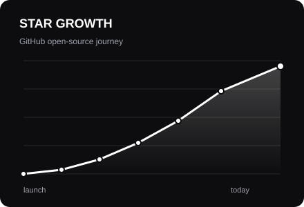
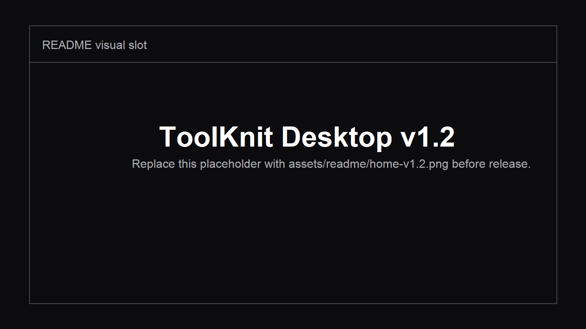
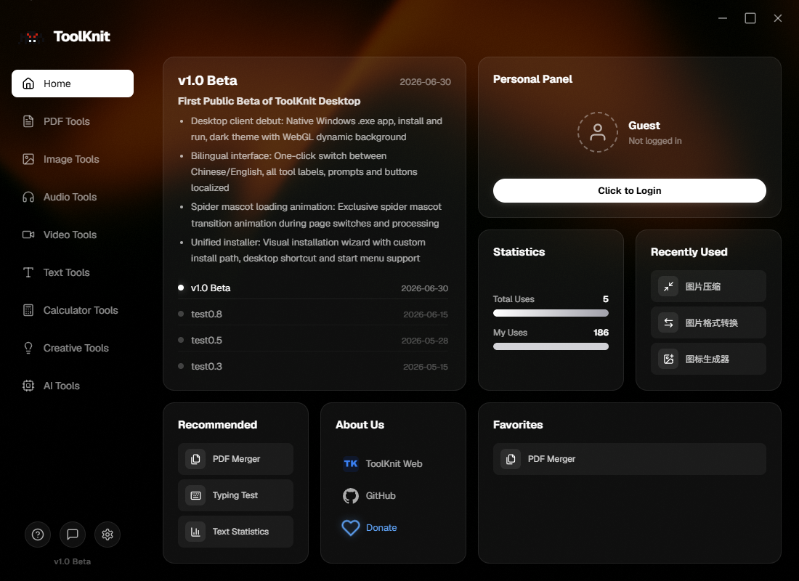

<table>
  <tr>
    <td width="72%" valign="top">
      
    </td>
    <td width="28%" valign="middle" align="center">
      <a href="https://github.com/ZihangDong/toolknit-desktop/stargazers">
        
      </a>
      <br /><br />
      
      <br />
      <strong>Open tools, shared with care.</strong>
      <br />
      <sub>Live Star badge from GitHub · Public donations: 23.88 CNY</sub>
    </td>
  </tr>
</table>

<h1 align="center">ToolKnit Desktop</h1>

<p align="center">
  <strong>Local-first multi-tool desktop app · Open-source desktop edition v1.2</strong><br />
  A Windows app for PDFs, images, audio/video, text, AI documents, AI tables, CLI workflows, and IDE Agent automation. Files stay local by default.
</p>

<p align="center">
  <a href="README.md">简体中文</a> ·
  <a href="https://github.com/ZihangDong/toolknit-desktop/releases">Download Desktop</a> ·
  <a href="https://toolknit.com">Web Version</a> ·
  <a href="#cli--ide-agent--mcp">CLI / Agent</a> ·
  <a href="toolknit-desktop/docs/agent-guide.en.md">Agent Guide</a>
</p>

<p align="center">
  <a href="LICENSE"></a>
  
  
  
</p>

<p align="center">
  
</p>

## Overview

ToolKnit Desktop is the open-source desktop companion to the ToolKnit web app. It is built for people who want their files to remain on their own machine while still having one clean place for everyday work: merging PDFs, extracting video frames, making GIFs, batch converting media, stitching long images, transcribing audio/video, and generating editable AI documents and tables.

It is useful for:

- Privacy-conscious users who do not want to upload documents or media to random online tools.
- Office and study workflows that need a focused all-in-one desktop toolbox.
- Creators who need fast extraction, conversion, stitching, and export tasks.
- Developers and AI IDE users who want CLI or Agent access to local file-processing tools.

Only AI-specific workflows send text to the model provider you configure yourself, such as AI polish, AI translate, AI documents, AI tables, or optional AI review after transcription. Regular PDF, image, audio/video, and text tools run locally by default.

## Support

If ToolKnit helps you, supporting the author keeps testing, mirrors, documentation, releases, and future development moving. Independent development takes time; support helps ToolKnit stay open-source, clean, local-first, and useful for Agent workflows.

<p align="center">
  <strong>Public donations so far: 23.88 CNY</strong><br />
  <sub>Public record: <a href="toolknit-desktop/public/contributors.json">contributors.json</a></sub>
</p>

<table>
  <tr>
    <th width="30%">WeChat Pay</th>
    <th width="30%">Alipay</th>
    <th width="40%">What support helps with</th>
  </tr>
  <tr>
    <td align="center"></td>
    <td align="center"></td>
    <td valign="top">
      <p>
        
        
        
      </p>
      <ul>
        <li><strong>Building is hard; maintaining open source is harder.</strong> Every bit of support helps ToolKnit keep moving.</li>
        <li>If you have a tool, format, or workflow improvement you really want, leave a note with your donation, open an Issue, or contact me through the web version.</li>
        <li>Clear, reproducible, maintainable requests are easier to evaluate and schedule for upcoming versions.</li>
      </ul>
      <sub>Support is not a paid outsourcing contract, but it does help me spend more focused time on ToolKnit.</sub>
    </td>
  </tr>
</table>

<p align="center">
  Prefer a no-install online experience? Visit <a href="https://toolknit.com"><strong>toolknit.com</strong></a>
</p>

<p align="center">
  <a href="https://toolknit.com">
    
  </a>
  <br />
  <a href="https://fmhy.net/misc">
    
  </a>
  
  
</p>

## v1.0 to v1.2

<table>
  <tr>
    <td width="48%" valign="top">
      <h3>v1.0</h3>
      
      <ul>
        <li>20+ basic desktop tools.</li>
        <li>Mainly click-based local processing.</li>
        <li>PDF, image, audio/video, text, and basic AI features.</li>
        <li>Fixed output behavior and limited preview editing.</li>
      </ul>
    </td>
    <td width="4%" align="center" valign="middle"><strong>-></strong></td>
    <td width="48%" valign="top">
      <h3>v1.2</h3>
      
      <ul>
        <li>30+ desktop tools, including video frame export, video-to-GIF, long image stitching, and audio/video transcription.</li>
        <li>Custom output root, per-tool output folders, custom backgrounds, and default background fallback.</li>
        <li>Most core file tools expose CLI contracts and MCP tools for IDE Agents.</li>
        <li>AI documents and AI tables now use inspectable, numbered, editable, undoable, re-renderable project workflows.</li>
      </ul>
    </td>
  </tr>
</table>

### v1.2 Highlights

| Update | What it enables |
| --- | --- |
| HD video frame export | Export PNG or high-quality JPG frames by time or frame position. |
| Video to GIF | Choose start/end, FPS, and width, then export palette-optimized GIFs up to 30 seconds. |
| Long image stitching | Stitch images and PDF pages horizontally or vertically with spacing, background, and reference sizing. |
| Audio/video transcription | Download a local Whisper model, then export TXT, SRT, and JSON; optional DeepSeek review is supported. |
| AI document upgrade | Generate PDF plus editable project, preview images, and numbered component maps; edit position, size, color, font, alignment, layer order, and undo history. |
| AI table workflow | Export XLSX, CSV, PDF, PNG, and editable projects; modify rows, columns, formulas, charts, and render again. |
| PDF page selection | Merge, split, and rotate flows now support preview, page picking, select all, clear all, and safe back navigation. |
| Dependency management | FFmpeg and transcription models are downloaded on demand from official or mirror sources. |
| CLI and Agent support | Core file tools have explicit input, output, progress, error-code, and help contracts for natural-language IDE Agent usage. |

## Tools

### PDF

| Tool | Description |
| --- | --- |
| PDF Merge | Pick files and pages, then merge in order. |
| PDF Split | Export selected pages, all pages, or ranges. |
| PDF Rotate | Rotate selected pages by 90/180/270 degrees. |
| PDF Encrypt / Decrypt | Add or remove password protection. |
| PDF Compress | Reduce file size while keeping the original. |
| PDF Enhance | Improve readability for scanned PDFs. |

### Image, Audio, Video, and Text

| Category | Tools |
| --- | --- |
| Image | Batch image conversion, image compression, long image stitching, icon generation, color extraction. |
| Audio | Format conversion, BPM detection, audio clipping, audio extraction from video. |
| Video | Format conversion, HD frame export, GIF export up to 30 seconds. |
| Text | Audio/video transcription, text statistics, text formatting. |

### AI and Utilities

| Category | Tools |
| --- | --- |
| AI | AI polish, AI translate, AI document, AI table. |
| Calculators | BMI, timestamp, mortgage, interest, password generator. |
| Creative | Typing test, color palette extraction. |

Calculator tools and the typing test remain desktop-first because CLI/MCP would not add much value there.

## Download and Usage

### Desktop App

Download the Windows installer from [GitHub Releases](https://github.com/ZihangDong/toolknit-desktop/releases). Optional components are not forced on first launch; when a tool needs FFmpeg or a local transcription model, the app explains why and points you to Settings.

In Settings, you can:

- Choose a global output root. ToolKnit then writes into per-tool subfolders.
- Configure DeepSeek/OpenAI-compatible AI providers.
- Download FFmpeg and Whisper models from official or mirror sources.
- Upload an image or video as the home/category background and restore the default animated background at any time.

### Run from Source

```powershell
git clone https://github.com/ZihangDong/toolknit-desktop.git
Set-Location toolknit-desktop\toolknit-desktop
npm ci
npm run tauri dev
```

Requirements: Windows 10/11, Node.js `20.12.0` or newer, and Rust stable for native desktop builds.

## CLI / IDE Agent / MCP

<a id="cli--ide-agent--mcp"></a>

v1.2 extracts the desktop app's core file-processing capabilities into verifiable CLI/MCP contracts. The desktop app is best for preview and visual editing; CLI is best for scripts, batch processing, and CI; IDE Agents can call the same capabilities through MCP without keeping the desktop window open.

### Test from the Source Tree

```powershell
Set-Location toolknit-desktop\toolknit-desktop
npm ci
npm run cli -- doctor
npm run cli -- help
npm run cli -- help pdf split
```

The CLI does not overwrite existing files by default. JSON and MCP output are kept clean without ASCII banners. Sensitive inputs such as PDF passwords use protected input paths instead of command history.

### After the npm Package Is Published

```powershell
npm install --global @toolknit/cli
toolknit doctor --json
toolknit --help
```

### MCP Example

Add this to Trae, Cursor, VS Code, or another MCP-capable client after `toolknit` is available on PATH:

```json
{
  "mcpServers": {
    "toolknit": {
      "command": "toolknit",
      "args": ["mcp", "serve"],
      "env": {
        "DEEPSEEK_API_KEY": "<only needed for AI document, AI table, or AI polish>"
      }
    }
  }
}
```

Recommended natural-language prompt:

> Inspect the local file first, then process it with ToolKnit. Write output into the current project's `toolknit-output` folder and do not overwrite existing files. For AI documents and AI tables, use `inspect -> dry-run -> commit -> render`.

Docs:

- [CLI and MCP contract](toolknit-desktop/docs/cli-agent.md)
- [Chinese Agent guide](toolknit-desktop/docs/agent-guide.zh-CN.md)
- [English Agent guide](toolknit-desktop/docs/agent-guide.en.md)
- [AI document project spec](toolknit-desktop/docs/ai-document-project-spec.md)

## Web Version

The ToolKnit web version provides a no-install cross-platform experience with more continuously updated online capabilities: [toolknit.com](https://toolknit.com). It is also listed on [FMHY](https://fmhy.net/misc) as a tool for image, video, PDF, audio, and file workflows.

This repository focuses on the Windows local desktop app, CLI, and MCP layer. The web service, domains, accounts, visual brand, and hosted operations are outside this repository's open-source license.

## Development and Feedback

| Topic | Link |
| --- | --- |
| Build guide | [BUILD.md](BUILD.md) |
| Contribution guide | [CONTRIBUTING.md](CONTRIBUTING.md) |
| Changelog | [toolknit-desktop/CHANGELOG.md](toolknit-desktop/CHANGELOG.md) |
| Bugs and requests | [GitHub Issues](https://github.com/ZihangDong/toolknit-desktop/issues) |

## License and Brand Notice

ToolKnit Desktop and the CLI/MCP source code in this repository are licensed under the [Apache License 2.0](LICENSE).

The license does not grant rights to the ToolKnit name, logos, visual identity, domains, official website, hosted web services, service accounts, or other independently operated products. See [NOTICE](NOTICE).
