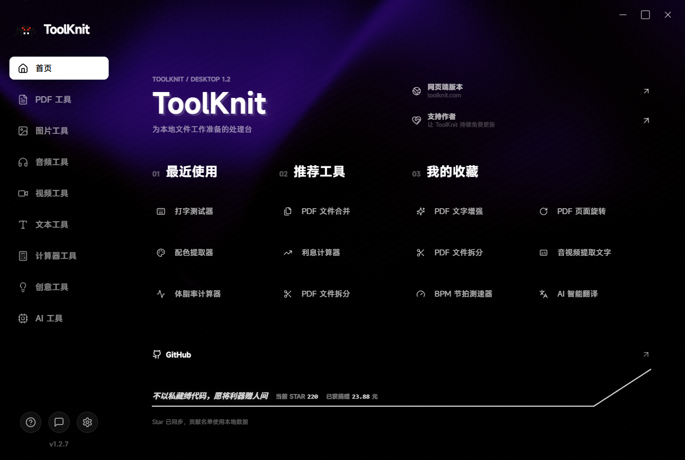

<table>
  <tr>
    <td width="76%" valign="top">
      
    </td>
    <td width="24%" valign="middle" align="center">
      <a href="https://github.com/ZihangDong/toolknit-desktop/stargazers">
        
      </a>
      <br /><br />
      <strong>每一颗 Star 都是继续维护的动力。</strong>
      <br />
      <sub>实时同步 GitHub Star 数量</sub>
    </td>
  </tr>
</table>

<h1 align="center">ToolKnit Desktop</h1>

<p align="center">
  <strong>多功能工具箱 · 桌面端开源版</strong><br />
  一个 exe 整合 PDF、图片、音视频、文本与 AI 文档工作流。默认本地处理，文件不上传。
</p>

<p align="center">
  <a href="https://github.com/ZihangDong/toolknit-desktop/releases"><strong>下载桌面版</strong></a> ·
  <a href="https://toolknit.com"><strong>访问网页端</strong></a> ·
  <a href="#cli--ai-agent">CLI / AI Agent</a> ·
  <a href="docs/agent-guide.en.md">English docs</a>
</p>

<p align="center">
  Windows 10/11 · Desktop + CLI + MCP · Local-first · Apache-2.0
</p>

<p align="center">
  
</p>

---

## 项目说明

ToolKnit Desktop 是 ToolKnit 网页端的开源桌面配套版本。它面向希望把文件留在本机、又不想在多个在线工具网站之间来回切换的人：合并 PDF、导出视频单帧、截取 GIF、批量转换媒体、拼接长图、离线转写、生成可编辑 AI 文档和表格，都可以在同一套本地工作流中完成。

适合以下用户：

- 注重隐私、不希望把工作文件上传给陌生网站的人。
- 需要把 PDF、图片、音视频和文本处理集中到一个桌面应用的效率工作者。
- 需要离线或弱网环境下完成文件处理的学生、办公人员和创作者。
- 希望通过 CLI、脚本或 IDE Agent 批量处理项目文件的开发者。

只有在你明确调用 AI 润色、翻译、AI 文档、AI 表格或转写二次润色时，相关文字才会发送到你自行配置的 AI 服务；本地文件工具不会上传源文件。

## 支持作者

> **如果 ToolKnit 帮到了你，欢迎支持作者继续维护。**
>
> 支持会用于测试设备、文档维护、运行时镜像、版本发布和后续功能开发。公开支持记录见 [docs/SUPPORT.md](docs/SUPPORT.md)。

<table>
  <tr>
    <th width="50%">微信支付</th>
    <th width="50%">支付宝</th>
  </tr>
  <tr>
    <td align="center"></td>
    <td align="center"></td>
  </tr>
</table>

<p align="center">
  想免安装使用更完整的在线能力？访问 <a href="https://toolknit.com"><strong>toolknit.com</strong></a>
</p>

---

## v1.0 -> v1.2

<table>
  <tr>
    <td width="46%" valign="top">
      <h3>v1.0</h3>
      <ul>
        <li>20+ 个基础桌面工具</li>
        <li>以点选式本地处理为主</li>
        <li>PDF、图片、音视频和基础 AI 能力</li>
        <li>固定输出与较少的预览编辑能力</li>
      </ul>
    </td>
    <td width="8%" align="center" valign="middle"><h2>-></h2></td>
    <td width="46%" valign="top">
      <h3>v1.2</h3>
      <ul>
        <li>32 个桌面工具，加入视频单帧图、视频转 GIF、长图拼接和音视频转文字</li>
        <li>可自定义输出根目录、二级分类目录和应用背景</li>
        <li>核心文件工具支持 CLI，并为 IDE Agent 提供 30 项 MCP 能力</li>
        <li>AI 文档/AI 表格升级为可检查、可编号、可编辑、可撤销、可重渲染的工程工作流</li>
      </ul>
    </td>
  </tr>
</table>

### v1.2 重点更新

| 更新 | 现在可以做什么 |
| --- | --- |
| 视频高清单帧图 | 按精确时间点或真实帧率定位，导出 PNG 无损图或高质量 JPG。 |
| 视频截取 GIF | 选择起始与结束帧、帧率和宽度，导出最长 30 秒的调色板优化 GIF。 |
| 音视频提取字幕文字 | 下载本地识别模型后离线转写音频或视频，输出 TXT、SRT、JSON；可选 AI 二次润色。 |
| AI 文档大升级 | 生成多页专业 PDF，同时输出可编辑工程、控件编号图和预览图；支持位置互换、颜色、字号、图层与撤销。 |
| AI 表格工程化 | 生成 CSV/XLSX/PDF/PNG，按稳定行、列、图表编号检查与修改，再重新渲染。 |
| PDF 选页体验 | 合并、拆分、旋转等工作流支持预览、逐页选择、全选和安全的返回逻辑。 |
| 输出与依赖管理 | 所有输出按工具分类到自定义目录；FFmpeg 和离线模型按需下载、校验与提示。 |
| CLI 与 AI Agent | 大部分核心文件处理工具拥有确定的命令、进度、错误和输出契约，可由 MCP Agent 自然语言调用。 |

## 功能总览

### PDF 工具

| 工具 | 说明 |
| --- | --- |
| PDF 合并 | 选择多个文件和页码后按顺序生成一个 PDF。 |
| PDF 拆分 | 按页导出，支持单页、全部或指定范围。 |
| PDF 旋转 | 对选定页面进行 90/180/270 度旋转。 |
| PDF 加密 / 解密 | 添加或移除 PDF 密码保护。 |
| PDF 压缩 | 按压缩等级减少文件体积并保留原件。 |
| PDF 增强 | 改善扫描件可读性。 |

### 图片、音频与视频

| 分类 | 工具 |
| --- | --- |
| 图片 | 批量格式转换、图片压缩、长图拼接、图标生成、配色提取。 |
| 音频 | 格式转换、BPM 节拍检测、音频剪辑、从视频提取音轨。 |
| 视频 | 格式转换、高清单帧图、最长 30 秒 GIF。 |
| 文本 | 离线音视频转文字、文本统计、文本格式化。 |

### AI、创意与常用小工具

| 分类 | 工具 |
| --- | --- |
| AI | AI 润色、AI 翻译、AI 文档、AI 表格。 |
| 计算器 | BMI、时间戳、房贷、利息、密码生成。 |
| 创意 | 打字测试、图片配色提取。 |

## 下载与使用

### 桌面端

从 [GitHub Releases](https://github.com/ZihangDong/toolknit-desktop/releases) 下载 Windows 安装包。首次使用不强制下载附加组件；进入需要 FFmpeg 或离线转写模型的工具时，桌面端会说明原因并提供设置入口。

在 **设置** 中可以：

- 选择全局输出根目录，所有工具自动进入对应二级目录。
- 配置 AI Provider 与本地离线识别模型。
- 选择 FFmpeg 官方源或镜像源。
- 上传图片或视频作为首页和分类页背景，随时恢复默认动态背景。

### 从源码运行

```powershell
git clone https://github.com/ZihangDong/toolknit-desktop.git
Set-Location toolknit-desktop
npm ci
npx tauri dev
```

要求：Windows 10/11、Node.js `20.12.0` 或更高版本；从源码构建原生桌面端还需要 Rust stable 工具链。

## CLI + AI Agent

<a id="cli--ai-agent"></a>

v1.2 将桌面端核心文件处理能力抽成可验证的 CLI/MCP 契约。桌面端适合预览与可视化编辑；CLI 适合脚本、批处理和 CI；IDE Agent 可以通过 MCP 调用同一套能力，不需要一直打开桌面程序。

### CLI

npm 包已发布，普通用户可直接全局安装：

```powershell
npm install --global @toolknit/cli@1.2.7
toolknit doctor --json
toolknit --help
```

当前在源码仓库内可直接测试：

```powershell
npm install
npm run cli -- doctor
npm run cli -- help video gif
```

CLI 要求明确输入与输出路径，默认不覆盖已有文件；JSON 与 MCP 输出不会混入 ASCII 横幅。PDF 密码使用受保护的 stdin 输入，不会进入命令历史。

### IDE Agent / MCP

在 Trae、Cursor、VS Code 或其他支持 MCP 的客户端中添加：

```json
{
  "mcpServers": {
    "toolknit": {
      "command": "toolknit",
      "args": ["mcp", "serve"],
      "env": {
        "DEEPSEEK_API_KEY": "<仅 AI 文档、AI 表格或 AI 润色需要>"
      }
    }
  }
}
```

推荐话术：**先检查，再处理指定本地文件；输出到当前项目的 `toolknit-output`；不要覆盖已有文件。**

AI 文档和 AI 表格修改应始终遵循：`inspect -> dry-run -> commit -> re-render`。查看完整示例：[中文 Agent 手册](docs/agent-guide.zh-CN.md) / [English Agent guide](docs/agent-guide.en.md)。

## 网页端

ToolKnit 网页端提供免安装、跨平台的在线体验与更多持续更新的能力：<strong><a href="https://toolknit.com">toolknit.com</a></strong>。

桌面端开源仓库专注于 Windows 本地文件处理、CLI 和 MCP；网页端的服务、域名、账号、视觉品牌和运营能力不属于本仓库的开源授权范围。

## 开发、反馈与文档

| 内容 | 链接 |
| --- | --- |
| CLI 与 MCP 契约 | [docs/cli-agent.md](docs/cli-agent.md) |
| AI 文档工程规范 | [docs/ai-document-project-spec.md](docs/ai-document-project-spec.md) |
| 贡献指南 | [CONTRIBUTING.md](CONTRIBUTING.md) |
| 安全报告 | [SECURITY.md](SECURITY.md) |
| 更新日志 | [CHANGELOG.md](CHANGELOG.md) |
| 提交 Bug / 建议 | [GitHub Issues](https://github.com/ZihangDong/toolknit-desktop/issues) |

## 开源协议与品牌说明

本仓库中的 ToolKnit Desktop 和 CLI/MCP 源代码采用 [Apache License 2.0](LICENSE) 开源。

协议不授予 ToolKnit 名称、Logo、视觉标识、域名、官网、托管网页服务、服务账号或其他独立运营产品的权利。详见 [NOTICE](NOTICE)。
