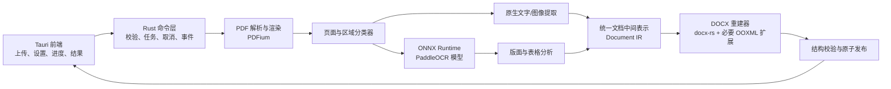

# ToolKnit Desktop PDF 转 DOCX：智能平衡模式技术规划

> 文档状态：开发前规划稿  
> 目标版本：ToolKnit Desktop 后续版本  
> 当前桌面端版本：1.2.8
> 编写日期：2026-08-03  
> 目标平台：Windows 优先，架构预留 macOS / Linux 兼容能力  
> 核心原则：纯本地处理、中文英文兼容、优先生成真正可编辑的 DOCX

## 1. 决策摘要

本功能采用“智能平衡模式”作为默认且首发的处理模式：

1. 先判断每一页属于原生文字页、扫描页还是混合页。
2. 原生 PDF 文字优先直接提取，避免不必要的 OCR 精度损失。
3. 扫描页以自适应 250–300 DPI 渲染，必要时提升到 350 DPI。
4. 混合页只对需要识别的图像区域执行 OCR，避免文字重复。
5. 使用版面分析恢复标题、段落、多栏、图片、表格、页眉和页脚。
6. DOCX 正文使用真实段落、列表和表格；仅对印章、签名、角标等特殊对象使用浮动定位。
7. 默认使用 PaddleOCR PP-OCRv6 Small；高精度模型作为可选下载项。
8. 桌面端不捆绑 Python，不要求用户安装 Python、PaddlePaddle 或 Office。
9. 推理使用 ONNX Runtime，在本地完成；模型首次使用时下载并校验。
10. 输出前进行结构校验、DOCX 包完整性校验和原子发布，失败时不留下损坏文件。

这不是“把 PDF 页面截图放进 Word”，也不是“给每个字创建一个文本框”。最终目标是让用户能够正常选择、修改、复制、重排和继续编辑文档内容。

## 2. 产品目标

### 2.1 用户目标

用户上传一个 PDF，ToolKnit 自动判断文档类型，并在本地生成尽可能保留原有结构、同时便于后续编辑的 `.docx` 文件。

用户不需要理解 OCR、DPI、文字层、版面模型或 Word XML。默认设置应适用于大多数中文、英文及中英混排文档。

### 2.2 首发范围

- 单个 PDF 转换为单个 DOCX。
- 支持原生文字 PDF、扫描 PDF、混合 PDF。
- 支持简体中文、繁体中文、英文及中英混排。
- 恢复段落、标题、列表、图片、表格、页眉、页脚和基本多栏结构。
- 保留页面尺寸、方向、分页和主要视觉层级。
- 支持密码已知的加密 PDF；不提供密码绕过或破解。
- 支持本地模型下载、断点续传、完整性校验、删除和升级。
- 提供页面级进度、当前阶段、取消和可理解的错误提示。
- 中英文 UI、帮助信息、错误码和更新日志同步完成。

### 2.3 首发不承诺

- 像素级复刻所有 PDF 排版。
- 可靠恢复手写文字、复杂数学公式、乐谱、CAD 图纸或特殊古籍排版。
- 从扫描图片恢复原始超链接地址、表单逻辑、批注和数字签名。
- 将所有脚注恢复为 Word 原生脚注。
- 将任意复杂跨页表格百分之百还原。
- 绕过未知 PDF 密码或权限保护。

遇到无法可靠结构化的内容时，应保留为可见图片或普通文本，并在转换报告中说明，而不是静默丢失。

## 3. 产品入口与用户流程

### 3.1 工具入口

- PDF 工具分类页新增“PDF 转 Word / PDF to Word”卡片。
- 全局搜索可通过“PDF 转 DOCX、PDF 转 Word、PDF to DOCX、PDF to Word、OCR”等关键词找到。
- PDF OCR 转换完成后，可预留“继续生成可编辑 Word”的关联入口。
- PDF 解密完成后，可预留“继续转 Word”的关联入口。

### 3.2 页面状态

#### 空状态

- 拖拽或选择一个 PDF。
- 明确显示“文件仅在本地处理”。
- 显示支持范围，而不是堆叠技术说明。
- 首次使用但模型未安装时，不阻止用户先选择文件。

#### 文件分析状态

- 显示文件名、大小、页数和是否加密。
- 快速分析各页类型：原生文字、扫描、混合。
- 汇总结果，例如“共 42 页：30 页直接提取，10 页 OCR，2 页混合处理”。
- 给出预计处理量，不承诺绝对完成时间。

#### 转换设置

首发只突出“智能平衡”模式，避免向普通用户暴露过多算法参数。

可提供以下少量选项：

- 输出语言：自动检测 / 简体中文优先 / 繁体中文优先 / 英文优先。
- 页面范围：全部 / 自定义范围。
- 图片质量：标准 / 清晰。
- 页眉页脚：智能保留 / 移除重复页眉页脚。
- 输出位置：沿用 ToolKnit 统一输出目录，也允许另存为。

高级诊断选项默认隐藏：

- 强制所有页面 OCR。
- 禁用表格恢复。
- 保留调试报告。

#### 模型下载状态

- 首次转换前提示需要下载约 42 MB 的默认模型资源。
- 支持官方源、中国大陆加速源和自动切换。
- 显示总进度、当前文件、下载速度、暂停后可恢复状态。
- 下载后显示“正在校验”，不得把下载完成等同于安装成功。
- 下载失败保留有效的 `.part` 文件，允许下次断点续传。

#### 转换状态

阶段文案必须对应真实执行过程：

1. 正在检查 PDF
2. 正在分析页面结构
3. 正在提取原生文字
4. 正在识别扫描内容
5. 正在恢复表格和图片
6. 正在生成 Word 文档
7. 正在校验输出文件

显示“第 N / M 页”，支持取消。取消后停止新任务、释放模型会话、删除临时文件，但不删除已经存在的用户文件。

#### 完成状态

- 显示输出路径、文件大小、耗时和转换摘要。
- 提供“打开文件”“打开所在文件夹”“继续转换”。
- 显示低置信度页、图片回退页、未能恢复的复杂表格数量。
- 不使用“100% 完美还原”等无法兑现的描述。

## 4. 总体架构



### 4.1 进程边界

- 前端负责用户交互、轻量预览、任务状态和双语文案。
- Rust 后端负责文件校验、PDF 解码、模型推理、内存控制、DOCX 生成和输出发布。
- 不通过 Tauri IPC 传输整页 Base64 图像。
- IPC 只传路径、设置、结构化状态和小尺寸缩略图 URL。
- 所有重计算放在后端工作线程，不阻塞 Tauri 主线程。

### 4.2 推荐依赖

| 能力 | 推荐方案 | 说明 |
| --- | --- | --- |
| PDF 解码、渲染、原生对象读取 | PDFium / `pdfium-render` | BSD 许可路线，避免引入 AGPL 依赖 |
| OCR 推理 | ONNX Runtime / Rust `ort` | 本地 CPU 推理，可后续增加 DirectML |
| OCR 模型 | PaddleOCR PP-OCRv6 Small | 默认中文英文及多语言平衡模型 |
| 版面分析 | PP-DocLayout-S | 小模型，识别段落、标题、图片、表格等区域 |
| 表格结构 | SLANet | 首发体积可控；复杂表格允许回退 |
| 图像预处理 | Rust `image` + `imageproc` 或自有模块 | 旋转、裁剪、缩放、二值化、去噪 |
| DOCX 生成 | `docx-rs` + 受控 OOXML 扩展 | 正文流式结构优先，特殊对象才锚定 |
| 压缩与包校验 | `zip` + XML 解析器 | DOCX 本质为 OOXML ZIP 包 |

依赖最终进入生产前，必须固定版本、检查许可证、记录来源和安全更新策略。

## 5. 智能平衡处理流水线

### 5.1 输入预检

输入必须满足：

- 是普通文件，不是目录、设备文件或符号链接。
- 扩展名和文件头均符合 PDF。
- 文件可读取且在限制范围内。
- PDF 页树、页面尺寸和对象数量没有明显异常。
- 加密 PDF 必须由用户提供正确密码，或先使用 ToolKnit PDF 解密功能。

建议首发限制：

- 单文件最大 200 MB。
- 最多 500 页。
- 单页渲染最大 60 Megapixels。
- 单边最大 12,000 像素。
- 超限时提示拆分文档，不尝试无限分配内存。

这些限制必须定义在后端，前端限制仅用于提前提示。

### 5.2 快速页面分析

先以低成本读取每页：

- 页面宽高、旋转角、裁切框和媒体框。
- 原生字符数量、Unicode 有效率、文本渲染模式和文字框分布。
- 页面图片数量、覆盖比例和分辨率。
- 矢量路径数量和复杂度。
- 是否存在隐藏 OCR 文字层。

页面分为：

- `native`：原生文字层可信，直接提取为主。
- `scanned`：主要内容是整页图像，需要 OCR。
- `mixed`：原生文字、图像文字或扫描区域同时存在。
- `unsafe_native`：有文字层但乱码、不可见、重复或映射质量差，改用 OCR。

不要只用“是否存在文字”判断。很多扫描 PDF 带有质量很差的隐藏 OCR 层，直接使用会生成乱码或重复内容。

### 5.3 原生文字可信度

原生文字质量评分至少包含：

- Unicode 可映射比例。
- 可打印字符比例。
- 可见文字比例。
- 字符框是否落在页面范围内。
- 字符密度是否合理。
- 大面积重复文本比例。
- 文本框与实际可见内容的空间一致性。

初始阈值只能作为工程起点，必须用测试集校准。例如 Unicode 有效率低于 95%、大量 `U+FFFD`、文字全部不可见或字符框严重重叠时，不信任原生文字层。

### 5.4 自适应渲染

- 默认 OCR 渲染 300 DPI。
- 页面文字较大且图像清晰时允许降至 250 DPI，节省时间和内存。
- 小字号、低分辨率或首轮置信度不足时，对目标区域以 350 DPI 重试。
- 不对整份文档一次性生成所有高清页面。
- 每页或每个区域处理完成后立即释放位图。
- 超大页面先分块，分块之间保留重叠边界，合并时去重。

### 5.5 图像预处理

预处理不是固定滤镜链，应按检测结果启用：

- 根据 PDF 页面旋转信息先纠正方向。
- 低置信度时检测 0° / 90° / 180° / 270°。
- 轻微倾斜使用文本基线估计进行校正。
- 对低对比扫描件执行局部对比度增强。
- 对彩色印章、图片和高质量扫描件避免强制二值化。
- 去噪、锐化和反色只在质量检测命中时启用。
- 保存变换矩阵，使 OCR 坐标能够准确映射回原始 PDF 坐标。

### 5.6 OCR 检测与识别

OCR 顺序：

1. 文字检测模型返回文本多边形。
2. 对文本区域执行方向矫正。
3. 识别模型输出文字和置信度。
4. 将坐标从渲染像素映射回 PDF 点坐标。
5. 合并同一行碎片，保留中英文间距语义。
6. 对低置信度区域执行一次受控重试。

重试条件可包括：

- 平均置信度低于校准阈值。
- 一行包含异常比例的乱码或孤立符号。
- 表格区域文字检测明显缺失。
- 小字号区域的有效字符高度不足。

最多自动重试一次，避免坏页面无限消耗 CPU。

### 5.7 混合页去重

混合页必须避免同时写入原生文字和 OCR 文字：

- 原生文字框与 OCR 框做空间重叠比较。
- 同一区域优先保留可信原生文字。
- 原生文字乱码或不可见时用 OCR 替换。
- OCR 仅覆盖图片文字、扫描块或不可信区域。
- 对相同文本、近似坐标和相似基线进行二次去重。

去重发生在中间表示层，不在最终 DOCX XML 上做字符串删除。

### 5.8 版面区域分析

版面模型输出候选区域：

- 标题、副标题、正文、列表。
- 表格、图片、图注。
- 页眉、页脚、页码。
- 公式、印章、签名和其他对象。
- 单栏、多栏和跨栏区域。

模型结果必须与 PDF 原生对象、OCR 行框共同融合。模型只提供候选，不直接决定最终 Word 结构。

### 5.9 阅读顺序恢复

建议组合以下规则：

- 先识别页面栏结构和跨栏标题。
- 同栏内按垂直位置排序。
- 使用基线、缩进、行距和标点判断段落边界。
- 列表编号与后续文本绑定。
- 图片和图注保持邻接。
- 表格作为单个结构块参与排序。
- 对竖排文字建立独立方向流；无法可靠恢复时保留为图片并提示。

不得简单按照 `y` 再按照 `x` 排序，否则双栏论文会发生左右内容交错。

### 5.10 页眉页脚识别

跨页比较归一化位置和内容：

- 在多页相近位置重复出现的内容视为候选页眉或页脚。
- 页码允许数字变化，但需识别序列关系。
- 仅出现一次的标题不能误判为页眉。
- 用户选择“移除重复页眉页脚”时，只移除高置信度重复对象。

一致的页码可转换为 Word `PAGE` 域；无法确认时保留普通文本。

### 5.11 表格恢复

表格按以下优先级处理：

1. 原生 PDF 中存在稳定线框和文字坐标时，先用几何规则重建。
2. 扫描表格使用 SLANet 识别行列、合并单元格和单元格顺序。
3. 将 OCR 文字分配到单元格，而不是输出 HTML 截图。
4. 推断边框、对齐、底色和列宽。
5. 跨页表格尽可能保持列宽，并标记重复表头。
6. 结构置信度不足时，整表以清晰图片回退，并在报告中注明。

绝不能生成行列错乱但看似“可编辑”的表格。结构错误时，视觉可靠的图片比错误数据更安全。

### 5.12 图片恢复

- 原始 PDF 中有可直接提取的无损图片时优先提取原图。
- 无法提取时从高分辨率页面裁剪。
- 图片裁剪区域需排除已经结构化的文字，避免重复。
- 保留宽高比，不拉伸。
- 对过大图片进行合理压缩，但不降低到影响阅读。
- 印章、签名和覆盖型标记使用浮动锚点；普通插图使用行内图片。

## 6. 统一文档中间表示

PDF 解析、OCR 和 DOCX 生成之间必须有稳定的中间表示，禁止让模型输出直接拼接 Word XML。

示意结构：

```json
{
  "schema": "toolknit.pdf-to-docx",
  "schemaVersion": 1,
  "source": {
    "path": "D:\\Documents\\source.pdf",
    "sha256": "...",
    "pageCount": 12
  },
  "pages": [
    {
      "index": 0,
      "widthPt": 595.28,
      "heightPt": 841.89,
      "rotation": 0,
      "classification": "mixed",
      "blocks": [
        {
          "id": "p1-b1",
          "type": "heading",
          "source": "native",
          "bboxPt": [56.0, 48.0, 483.0, 42.0],
          "confidence": 0.99,
          "readingOrder": 1,
          "lines": []
        }
      ]
    }
  ],
  "diagnostics": []
}
```

### 6.1 必要对象

- `Document`：来源、语言、页面、全局样式、诊断。
- `Page`：尺寸、方向、分类、页级变换矩阵。
- `Block`：标题、段落、列表、表格、图片、页眉页脚等。
- `Line`：基线、方向、文字片段、行高。
- `Span`：文字、字体线索、字号、粗体、颜色、来源和置信度。
- `Table` / `Row` / `Cell`：行列、跨行跨列、文字块和样式。
- `ImageAsset`：来源对象、裁剪区域、尺寸、摘要和临时路径。
- `Diagnostic`：错误码、严重级别、页码、对象和用户可读说明键。

### 6.2 坐标约定

- 中间表示统一使用 PDF point，1 point = 1/72 inch。
- 原点和方向必须统一，禁止模块自行猜测。
- 每次旋转、裁剪、缩放都保留可逆矩阵。
- DOCX 使用 twip 时统一换算：`1 point = 20 twips`。
- 浮点坐标进入 OOXML 前集中取整，避免各模块累积误差。

### 6.3 可追溯性

每个输出结构应记录来源：

- `native`：PDF 原生文字或对象。
- `ocr`：OCR 识别。
- `inferred`：版面规则推断。
- `fallback_image`：无法安全结构化的图片回退。

这使转换报告、调试和后续模型升级可以定位问题。

## 7. DOCX 重建策略

### 7.1 编辑性优先级

从高到低：

1. Word 原生段落和 Run。
2. Word 原生列表。
3. Word 原生表格。
4. 行内图片。
5. 少量浮动图片或文本对象。
6. 整页图片回退。

正文禁止按单字或单行创建绝对定位文本框。这样虽然短期视觉接近 PDF，但用户修改一个字就可能导致大量重叠，违背“可编辑 DOCX”的目标。

### 7.2 页面与节

- 根据 PDF 页面尺寸创建 Word Section。
- 保留纵向和横向页面。
- 页面尺寸变化时创建新的 Section Break。
- 页边距由主要正文区域估计，并设置合理下限。
- 页面之间使用显式分页，避免内容自然重排导致页数完全失控。

### 7.3 段落恢复

- 同一视觉段落的多行合并为一个 Word 段落。
- 中文行尾通常不插入空格。
- 英文断行需处理连字符：仅在词典和上下文支持时合并。
- 根据首行缩进、悬挂缩进和项目符号恢复段落格式。
- 通过行距和段间距区分换行与新段落。
- 不把 PDF 每一行都强制写成一个独立段落。

### 7.4 字体与样式

PDF 不一定提供可复用字体文件。首发采取字体映射：

- 中文正文优先映射到当前系统可用的中文无衬线或宋体类字体。
- 英文根据原字体类别映射到 serif / sans-serif / monospace。
- 字号根据文字框高度、基线和 PDF 原生字号综合估计。
- 粗体、斜体、颜色、对齐和下划线在证据足够时恢复。
- 字体不可用时写入兼容字体族和 East Asia 字体设置。
- 不把来源 PDF 的受限嵌入字体直接复制到 DOCX。

### 7.5 标题和列表

- 标题按字号、粗细、上下间距、编号和页面位置推断层级。
- 只在置信度足够时映射为 Word Heading 1–6。
- 有序、无序和多级列表使用 Word 编号定义。
- 无法确认的编号保留为普通段落文本，避免错误重编号。

### 7.6 多栏排版

- 整页稳定双栏或多栏时使用 Word Section Columns。
- 只有局部多栏时，优先使用无边框布局表格或分区策略。
- 严禁用大量空格模拟栏间距。
- 复杂杂志式版面允许局部图片回退。

### 7.7 特殊对象

以下对象允许使用锚定定位：

- 印章、签名、角标、水印。
- 覆盖正文的图形。
- 页边装饰和特殊浮动标注。

锚定对象必须绑定页面或段落锚点，并设置明确的环绕方式和层级。

### 7.8 文件生成与校验

生成流程：

1. 在 ToolKnit 临时目录创建 `.docx.part`。
2. 写入 OOXML 包和媒体资源。
3. 检查 `[Content_Types].xml`、关系文件、文档 XML 和媒体引用。
4. 重新打开 ZIP 并验证所有关系目标存在。
5. 解析关键 XML，确保格式正确。
6. 可选执行兼容性验证器。
7. 同卷原子重命名到最终 `.docx`。

如果验证失败，删除临时输出，不覆盖已有文件。

## 8. 模型与本地运行时

### 8.1 默认模型包

已读取 Paddle 官方归档响应头，源模型下载体积为：

| 组件 | 下载体积 |
| --- | ---: |
| PP-OCRv6 Small Detection | 9.59 MiB |
| PP-OCRv6 Small Recognition | 20.45 MiB |
| PP-DocLayout-S | 约 4.83 MB |
| SLANet | 约 6.9 MB |
| 默认模型源文件合计 | 约 41.77 MB |

高精度 OCR 可选包：

| 组件 | 下载体积 |
| --- | ---: |
| PP-OCRv6 Medium Detection | 59.39 MiB |
| PP-OCRv6 Medium Recognition | 73.29 MiB |
| Medium OCR 合计 | 132.68 MiB |

Tiny OCR 约 6.25 MiB，但不作为智能平衡默认项，因为文档转换比简单截图识字更重视小字号和混排稳定性。

注意：以上 OCR 数值是 Paddle 官方 Paddle 推理归档体积。实际发布的 ONNX 文件、预处理配置和压缩包大小可能不同，发布前必须以 ToolKnit 最终模型清单重新测量并更新 UI 文案。

### 8.2 ONNX 交付方式

- 维护者在构建/模型发布流水线中完成 Paddle 到 ONNX 的转换。
- 用户电脑不执行模型转换。
- 固定转换工具版本、opset、输入尺寸规则和预处理参数。
- 对 ONNX 输出与 Paddle 官方推理输出进行精度对比。
- 只有通过中文、英文、混排、旋转和表格测试后才进入模型清单。
- 如果 PP-OCRv6 Small 的目标算子在当前 ONNX Runtime 上无法稳定运行，首发回退到已经验证兼容的 PaddleOCR / RapidOCR ONNX 模型，不在用户端临时降级。

### 8.3 模型目录

建议统一模型管理目录：

```text
%APPDATA%/com.toolknit.desktop/models/
  transcription/
  pdf-to-docx/
    manifest.json
    pp-ocrv6-small/
      detection.onnx
      recognition.onnx
      charset.txt
      preprocess.json
    pp-doclayout-s/
      model.onnx
      labels.json
    slanet/
      model.onnx
      dictionary.txt
```

不继续把所有模型平铺在同一个 `models` 目录，避免语音模型和 OCR 模型发生命名、配置和升级冲突。

### 8.4 通用模型管理器

现有语音模型下载器已经具备以下能力：

- 官方源与中国镜像源。
- HTTP Range 断点续传。
- `.part` 临时文件。
- 文件大小验证。
- SHA-256 校验。
- 下载进度事件。
- 当前模型配置和删除能力。

开发本功能时应将它抽象为通用 `ModelManager`，而不是复制一套 OCR 专用下载代码。通用清单至少包含：

```json
{
  "bundleId": "pdf-to-docx-balanced-v1",
  "version": 1,
  "files": [
    {
      "path": "pp-ocrv6-small/detection.onnx",
      "bytes": 0,
      "sha256": "...",
      "sources": {
        "official": "https://...",
        "china": "https://..."
      }
    }
  ]
}
```

模型升级必须使用新的版本目录，全部文件校验成功后再切换活动版本，不能原地覆盖正在使用的模型。

### 8.5 运行时策略

- 默认 CPU Execution Provider。
- 根据逻辑核心数和内存限制线程数量，避免占满整台电脑。
- 首发可不启用 GPU，以减少兼容问题。
- 后续可验证 DirectML，但必须允许用户关闭并自动回退 CPU。
- 模型会话在单个任务内复用，任务结束后按内存压力决定保留或释放。
- 同一时间只运行一个 PDF 转 DOCX 重任务。

## 9. Rust 模块划分

不要继续把实现全部堆入当前较大的 `src-tauri/src/lib.rs`。建议拆分为：

```text
src-tauri/src/
  pdf_to_docx/
    mod.rs
    commands.rs
    task.rs
    input.rs
    pdf_engine.rs
    page_classifier.rs
    preprocess.rs
    ocr.rs
    layout.rs
    reading_order.rs
    table.rs
    ir.rs
    docx.rs
    validation.rs
    diagnostics.rs
  models/
    mod.rs
    manifest.rs
    downloader.rs
    registry.rs
    verification.rs
```

前端建议拆分为：

```text
src/
  pdf-to-docx-core.js
  pdf-to-docx-controller.js
```

`pdf-to-docx-core.js` 只包含可测试的范围解析、状态归约、摘要和错误映射；DOM 操作、Tauri invoke 和事件订阅放在 controller 或现有页面控制层。

## 10. Tauri 命令与事件契约

建议命令：

```text
inspect_pdf_for_docx(path, password?)
list_pdf_to_docx_model_bundles()
download_pdf_to_docx_model_bundle(bundle_id, source?)
delete_pdf_to_docx_model_bundle(bundle_id)
start_pdf_to_docx_conversion(request)
cancel_pdf_to_docx_conversion(task_id)
get_pdf_to_docx_task(task_id)
```

转换请求示意：

```json
{
  "inputPath": "D:\\Documents\\input.pdf",
  "outputPath": "D:\\Documents\\input.docx",
  "pageRanges": [{ "start": 1, "end": 12 }],
  "language": "auto",
  "imageQuality": "standard",
  "headerFooter": "preserve",
  "mode": "balanced"
}
```

统一进度事件：

```json
{
  "taskId": "...",
  "phase": "ocr",
  "page": 8,
  "pageCount": 42,
  "phaseProgress": 0.62,
  "overallProgress": 0.47,
  "messageKey": "tools.pdfToDocx.progress.ocr"
}
```

后端只发送稳定的 `messageKey` 和参数，用户可见文案由前端 i18n 渲染。事件中不得泄露密码、完整 OCR 内容或无必要的用户文件路径。

## 11. 状态机与错误处理

### 11.1 任务状态

```text
idle
-> inspecting
-> waiting_for_model
-> ready
-> converting
-> validating
-> completed

任意活动状态 -> cancelling -> cancelled
任意活动状态 -> failed
```

每个任务状态只能单向前进。过期事件必须通过 `taskId` 忽略，避免用户连续转换时旧任务覆盖新页面状态。

### 11.2 错误码

至少定义：

- `pdf-to-docx:input-not-found`
- `pdf-to-docx:invalid-pdf`
- `pdf-to-docx:password-required`
- `pdf-to-docx:invalid-password`
- `pdf-to-docx:file-too-large`
- `pdf-to-docx:too-many-pages`
- `pdf-to-docx:page-too-large`
- `pdf-to-docx:model-not-installed`
- `pdf-to-docx:model-download-failed`
- `pdf-to-docx:model-integrity-failed`
- `pdf-to-docx:runtime-unavailable`
- `pdf-to-docx:out-of-memory-risk`
- `pdf-to-docx:cancelled`
- `pdf-to-docx:output-exists`
- `pdf-to-docx:output-write-failed`
- `pdf-to-docx:docx-validation-failed`
- `pdf-to-docx:conversion-failed`

原始库错误写入受控日志，前端只显示可操作的中英文说明。

### 11.3 降级原则

- 单个段落 OCR 置信度低：保留文本并标记低置信度。
- 单个表格结构不可靠：表格图片回退。
- 单个复杂区域无法重建：区域图片回退。
- 单页解析失败但可渲染：整页 OCR 后继续。
- 单页无法解析也无法渲染：任务失败并指出页码，不静默跳页。
- DOCX 校验失败：整个任务失败，不发布损坏文件。

## 12. 性能、内存与稳定性

### 12.1 流式处理

- 快速分析可小并发读取页面元数据。
- 高清渲染、OCR 和版面推理采用受控流水线。
- 默认同时保留不超过两张高清页面位图。
- 表格和高分辨率重试进入单独限流队列。
- 已完成页面写入中间结果后释放图像内存。

### 12.2 并发策略

- 8 GB 内存设备默认单页 OCR。
- 16 GB 以上可启用两页流水线，但必须依据实测峰值调整。
- ONNX intra-op 线程和页面并发不可同时无限增大。
- UI 保持可响应，进度事件进行节流，避免每个 OCR 框都触发重绘。

### 12.3 临时文件

- 每个任务使用独立随机目录。
- 路径必须位于 ToolKnit 管理的临时根目录内。
- 正常结束、取消和失败都执行清理。
- 应用异常退出后，下次启动清理过期任务目录。
- 清理前验证真实路径仍位于预期根目录，禁止宽泛递归删除。

### 12.4 缓存

- 模型文件长期缓存。
- 用户页面图片默认不长期缓存。
- 可按源文件 SHA-256、模型版本和设置生成任务缓存键，但首发不必启用跨任务 OCR 缓存。
- 缓存机制不得让修改后的同名 PDF 复用旧结果。

## 13. 隐私、安全与许可证

### 13.1 隐私

- 文件、页面图像、OCR 文字和 DOCX 全部本地处理。
- 不调用云 OCR，不上传遥测内容。
- 日志默认不记录识别出的正文。
- 错误日志对用户路径进行必要脱敏。
- PDF 密码只在任务内存中使用，任务结束后立即释放，不写配置和日志。

### 13.2 不可信文档防护

- PDF 解码在受控线程执行并设置资源上限。
- 对超大图像、对象炸弹、异常页面尺寸和深层对象递归提前中止。
- DOCX 内不写入宏、外部模板、远程图片或不必要的外部关系。
- 超链接只保留原生 PDF 中明确存在且协议允许的链接。
- 输出文件名执行 Windows 保留名和非法字符处理。

### 13.3 许可证

预期许可证路线：

- PaddleOCR：Apache-2.0。
- ONNX Runtime：MIT。
- PDFium：BSD 风格许可证。
- `docx-rs`：以最终固定版本仓库声明为准，发布前复核。

必须更新桌面端第三方许可证和 NOTICE，记录模型权重来源、版本、文件 SHA-256、转换工具和转换日期。模型“可免费下载”不等于可以省略版权声明。

## 14. 测试策略

### 14.1 单元测试

- 页码范围解析与边界。
- 页面类型评分。
- PDF 坐标、像素和 twip 转换。
- 旋转和裁剪矩阵。
- OCR 框与原生框去重。
- 中英文行合并和英文断词处理。
- 段落、列表、标题层级推断。
- 多栏阅读顺序。
- 表格单元格分配和跨行跨列。
- 文件名生成和冲突策略。
- 状态机、取消和过期事件过滤。
- 模型清单解析、断点续传和哈希失败。
- DOCX ZIP 关系与 XML 校验。

### 14.2 集成测试语料

测试集不得只使用几份“好看的样例”。至少覆盖：

- 原生简体中文、繁体中文、英文和中英混排。
- 有字体映射和无 ToUnicode 映射的 PDF。
- 带正常隐藏 OCR 层、乱码 OCR 层和重复 OCR 层的扫描件。
- 72 / 150 / 300 / 600 DPI 扫描。
- 旋转、轻微倾斜、阴影、透视、低对比、噪点和反色页面。
- 单栏、双栏、三栏、跨栏标题和杂志布局。
- 有线表、无线表、合并单元格、跨页表格和嵌套表格。
- 印章、签名、水印、透明图片和文字覆盖图片。
- 横向页、混合页面尺寸和超长页面。
- 已知密码 PDF、损坏 PDF、空白 PDF和恶意构造样本。
- 1 页、100 页和 500 页压力样本。

测试 PDF 必须确认版权允许存入仓库；敏感真实文档不能作为测试资产提交。

### 14.3 输出兼容测试

生成的 DOCX 至少验证：

- Microsoft Word 当前支持版本打开时不提示修复。
- WPS Office 打开时结构和文字正常。
- LibreOffice 打开时不丢失主要内容。
- 重新保存后仍可再次打开。
- 全文搜索能找到 OCR 文字。
- 正文可跨行选择、复制和修改。
- 表格单元格可以独立编辑。
- 图片不变形，不超出页面。

### 14.4 自动视觉对比

测试环境将输出 DOCX 渲染为 PDF 或页面图像，与输入 PDF 对比：

- 页面尺寸和方向。
- 主要区域位置。
- 标题和正文层级。
- 图片尺寸与裁剪。
- 表格外框和单元格结构。
- 是否出现文字溢出、重叠或空白页。

视觉相似度只是一个指标，不能以牺牲编辑性为代价追求像素重合。

### 14.5 首发验收指标

建议在固定内部测试集上采用：

- 清晰 300 DPI 中英文印刷文档字符错误率不高于 2%。
- 可信原生文字页字符保真率至少 99.5%。
- 正文阅读顺序人工验收通过率至少 95%。
- 常规表格结构恢复通过率至少 90%。
- 至少 90% 的普通正文以流式段落而非文本框输出。
- 全测试集无崩溃、无损坏 DOCX、无静默丢页。
- 50 页任务取消后可在合理时间内停止，且无残留大体积临时文件。
- 8 GB 内存基准设备处理 A4 文档时峰值内存受控，不触发系统级内存压力。

这些指标必须由固定测试集、脚本和报告支撑，不能只凭主观打开几份文件判断。

## 15. 可观测性与转换报告

默认向用户展示简洁摘要：

- 直接提取页数。
- OCR 页数。
- 混合处理页数。
- 恢复表格数量。
- 图片回退区域数量。
- 低置信度页码。

开发构建可保留详细 JSON 诊断：

- 模型和运行时版本。
- 每页分类分数。
- 各阶段耗时。
- OCR 平均置信度。
- 降级原因。
- 内存峰值近似值。

生产版默认不写出 OCR 正文调试数据。用户主动启用“保留诊断报告”时，也应提示报告可能包含文档结构和路径信息。

## 16. 开发阶段

### 阶段 0：技术可行性门槛

- 固定候选 PaddleOCR 模型和 ONNX Runtime 版本。
- 完成 PP-OCRv6 Small 的 ONNX 转换与数值一致性验证。
- 验证 PDFium 在 Tauri Windows 安装包中的加载、许可和渲染稳定性。
- 验证 `docx-rs` 对段落、表格、分节、页眉页脚、图片和字体设置的覆盖程度。
- 用 20–30 页代表性中英文样本打通 PDF -> IR -> DOCX 最小链路。

阶段 0 不通过时不能直接进入完整 UI 开发。

### 阶段 1：原生 PDF 最小闭环

- 输入预检和页面范围。
- 原生文字、图片、页面尺寸提取。
- 基础段落和图片 DOCX。
- 输出原子发布和校验。
- 任务进度、取消、错误码。

### 阶段 2：扫描 PDF OCR

- 通用模型管理器。
- 图像预处理和 OCR。
- 文字行、段落和中英文空格恢复。
- 低置信度重试。
- 扫描页测试集与指标脚本。

### 阶段 3：智能混合与版面

- 页面分类、隐藏文字层判断和混合页去重。
- PP-DocLayout-S。
- 多栏阅读顺序、标题、列表、页眉页脚。
- 复杂区域图片回退。

### 阶段 4：表格与高级 DOCX

- SLANet 和几何表格识别。
- 合并单元格、重复表头、跨页表格。
- 页眉页脚、页码域、多尺寸 Section。
- 印章、签名等浮动对象。

### 阶段 5：产品界面与双语接入

- 工具卡片、搜索、页面、设置、进度和完成状态。
- 中文英文完整文案。
- 帮助中心、隐私说明、第三方许可。
- 关联工具入口。

### 阶段 6：生产验收

- 单元、集成、视觉、兼容性和压力测试。
- 安装、升级、卸载、模型保留和模型删除测试。
- 断网、代理、下载中断、磁盘不足和只读目录测试。
- 更新日志和发布检查。

## 17. 项目文件同步清单

实际开发时至少检查并按需同步以下位置，避免只把功能写进一个页面：

### 前端功能

- `index.html`：工具页面结构、入口和需要的模板。
- `src/main.js`：工具注册、路由、事件、Tauri invoke 和生命周期清理。
- `src/pdf-to-docx-core.js`：纯业务逻辑。
- `src/pdf-to-docx-controller.js`：页面控制和任务绑定。
- `src/styles.css`：沿用现有工具页设计系统，补充专属状态样式。

### 双语与帮助

- `src/locales/zh.json`：全部中文 UI、错误、进度、工具卡片和搜索词。
- `src/locales/en.json`：与中文键完全对应的英文文案。
- `src/help-data.js`：中文帮助和常见问题。
- `src/help-data-en.js`：英文帮助和常见问题。
- 搜索、PDF 分类数量和首页工具数量相关文案。

### Rust 与 Tauri

- `src-tauri/src/lib.rs` / `src-tauri/src/pdf_to_docx/`：命令注册和核心实现。
- `src-tauri/src/models/`：通用模型管理。
- `src-tauri/Cargo.toml`、`Cargo.lock`：固定依赖。
- `src-tauri/capabilities/default.json`：仅增加确实需要的权限。
- `src-tauri/tauri.conf.json`：运行时资源、安装包资源和资源访问范围。
- `src-tauri/build.rs`：必要的资源构建检查。
- `src-tauri/windows/installer.nsi`：第三方组件和卸载行为。
- `src-tauri/resources/`：PDFium / ONNX Runtime 及许可证；模型不默认打入安装包。

### 测试与发布

- `scripts/test-pdf-to-docx-core.mjs`：前端核心逻辑测试。
- Rust 单元和集成测试模块。
- `scripts/qa-pdf-to-docx.mjs`：代表性工作流和产物校验。
- `package.json`：测试命令。
- `CHANGELOG.md`：发布记录。
- 第三方许可证 / NOTICE。
- GitHub README、功能列表和版本发布说明。
- CLI / Agent 工具清单仅在功能真正支持自动化调用时同步，不能先放空入口。

## 18. 风险与应对

| 风险 | 后果 | 应对 |
| --- | --- | --- |
| PP-OCRv6 转 ONNX 存在算子兼容问题 | 无法稳定推理 | 阶段 0 做数值验证，准备经过验证的兼容模型回退 |
| PDF 有乱码隐藏文字层 | 输出乱码或重复文字 | 原生文字可信度评分，混合页去重，必要时 OCR 替换 |
| 双栏阅读顺序错误 | DOCX 内容语义混乱 | 版面模型 + 栏检测 + 阅读顺序测试集 |
| 表格结构误判 | 数据落入错误单元格 | 几何与模型融合，低置信度图片回退 |
| 绝对定位过多 | Word 无法正常编辑 | 正文流式结构硬性指标，定位仅限特殊对象 |
| 大文档占用过高 | 卡死或崩溃 | 页面流式处理、像素上限、并发限流、取消 |
| 模型下载损坏 | 推理崩溃或错误 | 大小 + SHA-256 校验，版本目录原子切换 |
| Office 实现差异 | Word/WPS/LibreOffice 显示不同 | 三套应用兼容测试，限制非标准 OOXML |
| 模型或运行时增大安装包 | 用户不愿下载 | 模型按需下载，运行时体积单独测量和说明 |
| 用户误解为云端处理 | 隐私担忧 | 页面明确本地处理，代码不包含云 OCR 路径 |

## 19. 完成定义

只有同时满足以下条件，功能才可标记为生产完成：

- 原生、扫描和混合 PDF 三条链路均可用。
- 中文、英文和中英混排达到固定测试集指标。
- 默认模型可下载、续传、校验、升级和删除。
- 转换全程可取消，失败和取消不留下损坏输出。
- DOCX 能被 Word、WPS 和 LibreOffice 无修复提示打开。
- 正文、列表和常规表格是真正可编辑结构。
- 低置信度内容有明确回退和转换报告。
- 页面、入口、搜索、帮助和错误文案完成中英文同步。
- 安装包包含所有运行时许可证和 NOTICE。
- 单元测试、集成测试、视觉测试、压力测试全部通过。
- 更新日志和发布说明准确说明能力与限制。

## 20. 已锁定与待验证事项

### 已锁定

- 默认产品模式：智能平衡。
- 默认策略：原生直取 + 区域 OCR + 结构化 DOCX。
- 默认 OCR 候选：PP-OCRv6 Small。
- 推理方向：ONNX Runtime 本地运行。
- 不捆绑 Python。
- 不上传用户文件。
- 模型首次使用时下载。
- 不采用全页、全字绝对定位作为主要输出结构。

### 开发前必须验证

- PP-OCRv6 Small 转 ONNX 后的算子兼容性和精度差异。
- 最终 ONNX 模型文件体积和 SHA-256。
- PP-DocLayout-S、SLANet 的最终 ONNX 交付格式。
- PDFium Windows 运行时最终体积和打包路径。
- `docx-rs` 不能覆盖的 OOXML 能力清单。
- 默认 250 / 300 / 350 DPI 阈值在真实测试集上的收益。
- 8 GB 设备上的线程数、峰值内存和每页速度。
- DirectML 是否值得进入后续版本。

待验证事项必须由阶段 0 的可复现测试结果决定，不能凭感觉写死到生产代码中。
